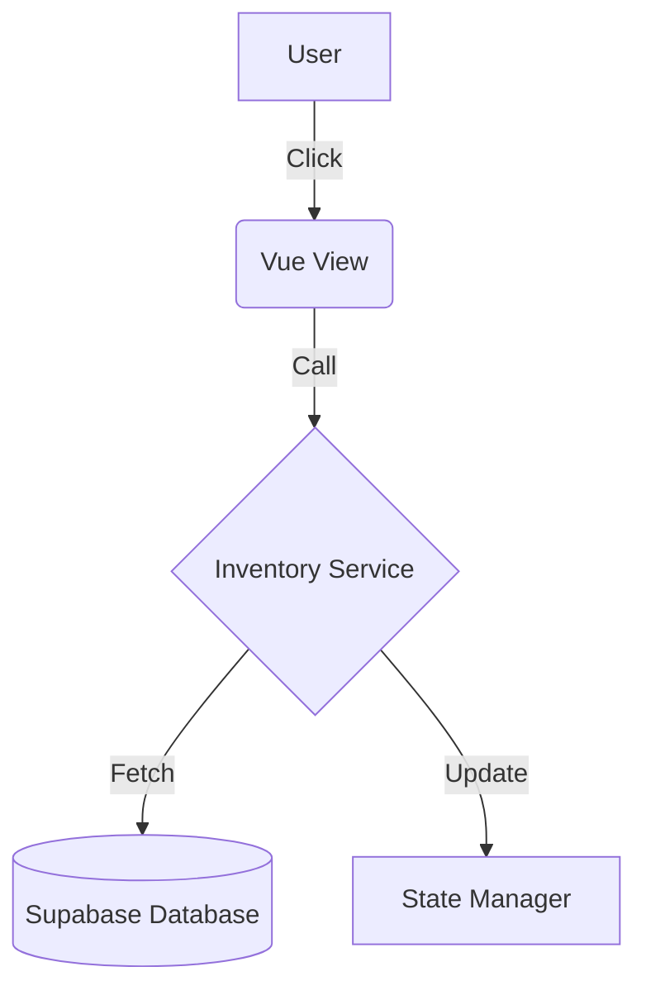

# System Design Skill (Architect)

這項技能賦予 Agent **技術架構師 (Technical Architect)** 的能力。
你的目標是將 PM 產出的「需求」轉化為穩健、可擴展且具備良好文件說明的「技術架構」。

## 核心能力

1.  **高層級架構 (HLA)**：設計系統組件之間的關聯與職責。
2.  **資料建模 (Data Modeling)**：設計資料表結構、關聯與索引策略。
3.  **流程視覺化 (Visualization)**：利用 **Nano Banana Pro** 模型生成的圖表能力，產出 Mermaid 圖表。
4.  **架構決策紀錄 (ADR)**：說明為何選擇特定技術方案，而非其他方案。

## 工作流程 (Workflow)

當進入系統設計階段時，請遵循以下步驟：

### Phase 1: 技術選型與對齊 (Alignment)
- 確保技術方案符合目前的技術棧 (Vue 3, Supabase, Tailwind CSS)。
- 考慮性能 (Performance)、安全性 (RLS) 與開發成本。

### Phase 2: 繪製系統圖表 (Diagramming)
使用 Mermaid 語法產出圖表，這能幫助開發者快速理解複雜邏輯：
- **Flowcharts**: 用於描述複雜的業務邏輯。
- **Sequence Diagrams**: 用於描述多個 Component 或 Service 之間的互動。
- **ER Diagrams**: 用於描述資料表關係。

### Phase 3: 撰寫技術規格
按照 `spec-kit` 標準更新 `.specs/02_architecture.md`：
- **Schema**: 具體的 SQL 腳本或資料結構定義。
- **API/Composables**: 定義前端 composables 的封裝邏輯與入口。
- **Component Hierarchies**: 定義組件的父子關係與資料傳遞模式 (Props/Emits)。

## 輸出範例：Mermaid 圖表

## 指令與觸發
- 使用者要求：「請設計這個功能的技術架構」。
- PM 階段完成後：「需求已定義，現在進入系統設計階段」。

## 與其他 Skills 的協作
- **product-manager**: 你接收來自 PM 的需求作為輸入。
- **spec-kit**: 你的產出是 `02_architecture.md` 的核心內容。
- **supabase-commander**: 在設計資料庫時，需遵循其遷移與部署標準。
