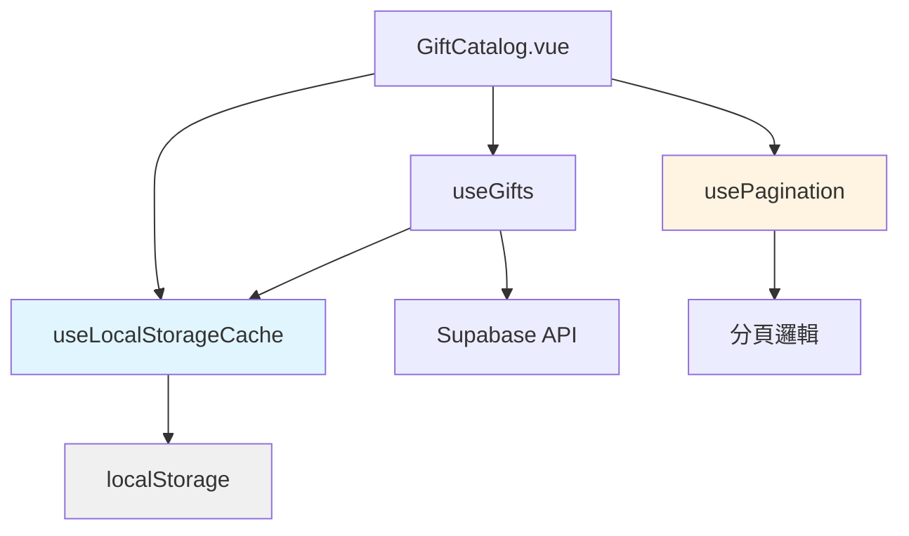
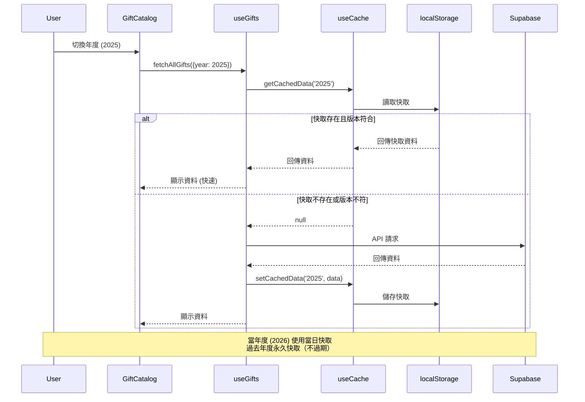
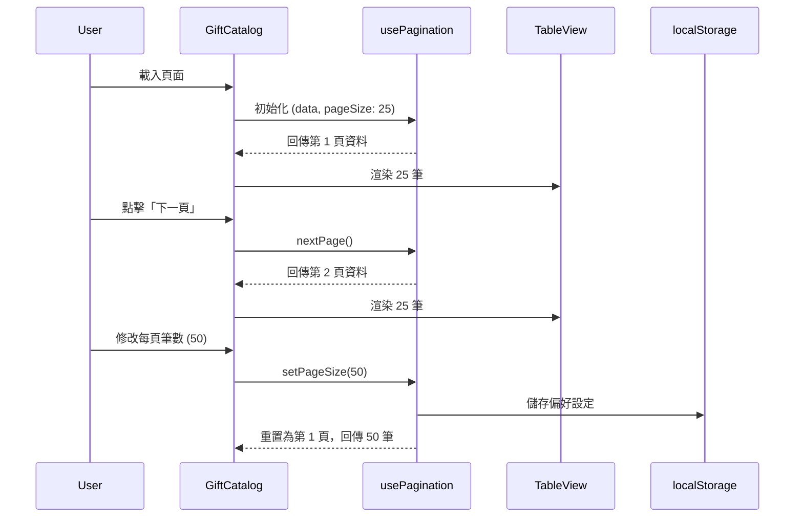

# 系統架構：紀念品目錄效能優化

## 1. 架構概覽

本次優化採用「前端快取 + 前端分頁」策略，不涉及後端 API 變更。主要變更集中在前端的資料管理層與 UI 層。



## 2. 資料流程

### 2.1 快取流程圖



### 2.2 分頁流程圖



## 3. 核心模組設計

### 3.1 `useLocalStorageCache` Composable

**檔案位置**：`src/composables/useLocalStorageCache.js`

**功能**：
- 提供通用的 localStorage 快取管理
- 支援過期時間設定
- 版本控制
- 錯誤處理與 fallback

**API 設計**：
```javascript
export function useLocalStorageCache(options = {}) {
  const {
    prefix = 'stock-souvenir',
    version = '1.0'
  } = options

  /**
   * 取得快取資料
   * @param {string} key - 快取鍵值
   * @returns {any|null} - 快取資料或 null
   */
  const get = (key) => { /* ... */ }

  /**
   * 設定快取資料（永久儲存）
   * @param {string} key - 快取鍵值
   * @param {any} data - 要快取的資料
   */
  const set = (key, data) => { /* ... */ }

  /**
   * 移除快取
   * @param {string} key - 快取鍵值
   */
  const remove = (key) => { /* ... */ }

  /**
   * 清除所有快取
   */
  const clear = () => { /* ... */ }

  /**
   * 檢查快取是否存在且有效
   * @param {string} key - 快取鍵值
   * @returns {boolean}
   */
  const has = (key) => { /* ... */ }

  return { get, set, remove, clear, has }
}
```

**快取資料結構**：
```typescript
interface CacheEntry {
  data: any
  timestamp: number  // 建立時間戳
  version: string
  year: number       // 年度資訊
  date?: string      // 快取建立日期 (YYYY-MM-DD)，僅當年度使用
}
```

### 3.2 `usePagination` Composable

**檔案位置**：`src/composables/usePagination.js`

**功能**：
- 前端分頁邏輯
- 記住使用者偏好設定
- 自動重置邏輯（篩選變更時）

**API 設計**：
```javascript
export function usePagination(items, options = {}) {
  const {
    defaultPageSize = 25,
    pageSizeOptions = [10, 25, 50, 100],
    storageKey = 'pagination-pageSize'
  } = options

  // Reactive state
  const currentPage = ref(1)
  const pageSize = ref(loadPageSizePreference() || defaultPageSize)

  // Computed
  const totalPages = computed(() => Math.ceil(items.value.length / pageSize.value))
  const paginatedItems = computed(() => {
    const start = (currentPage.value - 1) * pageSize.value
    const end = start + pageSize.value
    return items.value.slice(start, end)
  })
  const hasNextPage = computed(() => currentPage.value < totalPages.value)
  const hasPrevPage = computed(() => currentPage.value > 1)

  // Methods
  const nextPage = () => { /* ... */ }
  const prevPage = () => { /* ... */ }
  const goToPage = (page) => { /* ... */ }
  const setPageSize = (size) => { 
    pageSize.value = size
    currentPage.value = 1
    savePageSizePreference(size)
  }
  const reset = () => { currentPage.value = 1 }

  return {
    currentPage,
    pageSize,
    totalPages,
    paginatedItems,
    hasNextPage,
    hasPrevPage,
    nextPage,
    prevPage,
    goToPage,
    setPageSize,
    reset,
    pageSizeOptions
  }
}
```

### 3.3 `useGifts` Composable 更新

**檔案位置**：`src/composables/useGifts.js`

**變更內容**：
- 整合 `useLocalStorageCache`
- 修改 `fetchAllGifts` 方法，加入快取邏輯
- 當年度判斷邏輯

**修改後的 `fetchAllGifts`**：
```javascript
const fetchAllGifts = async (filters = {}) => {
  loading.value = true
  error.value = null

  try {
    const currentYear = new Date().getFullYear()
    const today = new Date().toISOString().split('T')[0] // YYYY-MM-DD
    const requestYear = filters.year
    const cacheKey = `gifts:${requestYear}`
    
    // 檢查快取
    if (requestYear) {
      const cached = cache.get(cacheKey)
      
      if (cached) {
        // 過去年度：永久快取
        if (requestYear !== currentYear.toString()) {
          gifts.value = cached
          loading.value = false
          return { data: cached, error: null, fromCache: true }
        }
        
        // 當年度：檢查是否為今天的快取
        if (cached.date === today) {
          gifts.value = cached
          loading.value = false
          return { data: cached, error: null, fromCache: true }
        }
      }
    }

    // 呼叫 API
    let query = supabase
      .from('souvenirs')
      .select('*')
      .order('meeting_date', { ascending: false })
      .order('updated_at', { ascending: false })

    // ... 套用篩選條件 ...

    const { data, error: fetchError } = await query

    if (fetchError) throw fetchError

    gifts.value = data || []
    
    // 儲存快取
    if (requestYear) {
      const cacheData = {
        ...data,
        date: requestYear === currentYear.toString() ? today : undefined
      }
      cache.set(cacheKey, cacheData)
    }

    return { data, error: null, fromCache: false }
  } catch (e) {
    console.error('取得紀念品列表失敗:', e)
    error.value = e.message
    
    // Fallback: 嘗試使用快取（即使過期）
    if (filters.year) {
      const cached = cache.get(`gifts:${filters.year}`)
      if (cached) {
        gifts.value = cached
        return { data: cached, error: e, fromCache: true }
      }
    }
    
    return { data: null, error: e }
  } finally {
    loading.value = false
  }
}
```

## 4. UI 元件變更

### 4.1 [MODIFY] [GiftCatalog.vue](file:///Users/unizalin/github/stock-souvenir/src/views/GiftCatalog.vue)

**變更內容**：
1. 引入 `usePagination` composable
2. 新增「每頁筆數選擇器」UI
3. 新增「分頁控制器」UI
4. 修改資料綁定：從 `filteredGifts` 改為 `paginatedItems`
5. 新增快取狀態指示（可選）

**新增 UI 區塊**：

#### 每頁筆數選擇器（加入篩選列）
```vue
<!-- 在篩選列的 Sort 旁邊新增 -->
<div class="relative group">
  <label class="absolute text-xs font-semibold text-indigo-500 -top-2.5 left-3 bg-white px-1">
    每頁筆數
  </label>
  <div class="relative">
    <select
      v-model="pageSize"
      @change="handlePageSizeChange"
      class="w-full px-4 py-2.5 border border-gray-200 rounded-xl focus:ring-2 focus:ring-indigo-500 focus:border-transparent bg-gray-50 focus:bg-white transition-colors cursor-pointer appearance-none">
      <option v-for="size in pageSizeOptions" :key="size" :value="size">
        {{ size }} 筆
      </option>
    </select>
    <div class="absolute right-3 top-3 pointer-events-none">
      <svg class="w-5 h-5 text-gray-400" fill="none" viewBox="0 0 24 24" stroke="currentColor">
        <path stroke-linecap="round" stroke-linejoin="round" stroke-width="2" d="M19 9l-7 7-7-7" />
      </svg>
    </div>
  </div>
</div>
```

#### 分頁控制器（列表下方）
```vue
<!-- 在 TableView 下方新增 -->
<div v-if="totalPages > 1" class="mt-8 flex items-center justify-center gap-4">
  <!-- 上一頁 -->
  <button
    @click="prevPage"
    :disabled="!hasPrevPage"
    class="px-4 py-2 rounded-lg border border-gray-200 text-gray-700 hover:bg-gray-50 disabled:opacity-50 disabled:cursor-not-allowed transition-colors flex items-center gap-2">
    <svg class="w-4 h-4" fill="none" viewBox="0 0 24 24" stroke="currentColor">
      <path stroke-linecap="round" stroke-linejoin="round" stroke-width="2" d="M15 19l-7-7 7-7" />
    </svg>
    上一頁
  </button>

  <!-- 頁碼資訊 -->
  <div class="flex items-center gap-3">
    <span class="text-sm text-gray-600">
      第 <span class="font-bold text-indigo-600">{{ currentPage }}</span> 頁 / 共 {{ totalPages }} 頁
    </span>
    
    <!-- 快速跳頁 -->
    <select
      v-model="currentPage"
      class="px-3 py-1.5 border border-gray-200 rounded-lg text-sm focus:ring-2 focus:ring-indigo-500">
      <option v-for="page in totalPages" :key="page" :value="page">
        跳至第 {{ page }} 頁
      </option>
    </select>
  </div>

  <!-- 下一頁 -->
  <button
    @click="nextPage"
    :disabled="!hasNextPage"
    class="px-4 py-2 rounded-lg border border-gray-200 text-gray-700 hover:bg-gray-50 disabled:opacity-50 disabled:cursor-not-allowed transition-colors flex items-center gap-2">
    下一頁
    <svg class="w-4 h-4" fill="none" viewBox="0 0 24 24" stroke="currentColor">
      <path stroke-linecap="round" stroke-linejoin="round" stroke-width="2" d="M9 5l7 7-7 7" />
    </svg>
  </button>
</div>
```

### 4.2 快取狀態指示（可選功能）

在篩選列下方新增快取狀態提示：
```vue
<div v-if="isUsingCache" class="mt-2 flex items-center gap-2 text-xs text-gray-500">
  <svg class="w-4 h-4" fill="none" viewBox="0 0 24 24" stroke="currentColor">
    <path stroke-linecap="round" stroke-linejoin="round" stroke-width="2" 
      d="M5 8h14M5 8a2 2 0 110-4h14a2 2 0 110 4M5 8v10a2 2 0 002 2h10a2 2 0 002-2V8m-9 4h4" />
  </svg>
  使用快取資料（{{ cacheTimestamp }}）
</div>
```

## 5. 資料庫變更

**無需變更**。本次優化完全在前端實作，不涉及 Supabase Schema 或 RLS 政策調整。

## 6. 邊界情況處理

### 6.1 localStorage 不可用
- 檢測 `localStorage` 是否可用（try-catch）
- 不可用時，自動 fallback 到純 API 模式
- 顯示提示訊息（可選）

### 6.2 快取損壞
- JSON parse 失敗時，自動清除該快取
- 重新呼叫 API

### 6.3 版本不符
- 檢查 `version` 欄位
- 不符時自動清除舊快取

### 6.4 篩選與分頁衝突
- 篩選條件變更時，自動重置為第一頁
- 使用 `watch` 監聽 `filters` 變化

### 6.5 空資料
- 總頁數為 0 時，隱藏分頁控制器
- 顯示「沒有找到相關紀念品」訊息

## 7. 效能考量

### 7.1 localStorage 容量
- 單一年度資料約 500KB（775 筆）
- 預估最多儲存 5 個年度 = 2.5MB
- 遠低於 localStorage 5-10MB 限制

### 7.2 分頁效能
- 使用 `computed` 自動快取計算結果
- `slice` 操作複雜度 O(n)，n ≤ 100，效能可接受

### 7.3 記憶體使用
- 完整資料保留在 `gifts.value`
- 分頁僅產生新陣列引用，不複製物件

## 8. 安全性考量

### 8.1 XSS 防護
- localStorage 資料來自 Supabase API（已信任）
- 不儲存使用者輸入
- Vue 自動轉義 HTML

### 8.2 資料隱私
- 僅快取公開資料（紀念品目錄）
- 不快取使用者個人資料（收藏記錄）

## 9. 測試策略

### 9.1 單元測試（可選）
- `useLocalStorageCache` 的 get/set/remove 方法
- `usePagination` 的分頁邏輯

### 9.2 整合測試
- 快取流程：切換年度 → 檢查 localStorage → 驗證資料
- 分頁流程：切換頁面 → 驗證顯示筆數

### 9.3 手動測試
- 瀏覽器開發者工具檢查 localStorage
- 網路節流測試快取效果
- 不同裝置測試 RWD

## 10. 部署計畫

### 10.1 向下相容性
- 新功能不影響現有功能
- 無需資料庫遷移
- 無需後端部署

### 10.2 發布策略
- 前端部署即可
- 建議先在 staging 環境測試
- 監控 localStorage 相關錯誤

### 10.3 回滾計畫
- 若出現問題，可快速回滾前端程式碼
- 使用者快取會自動過期（24 小時）
