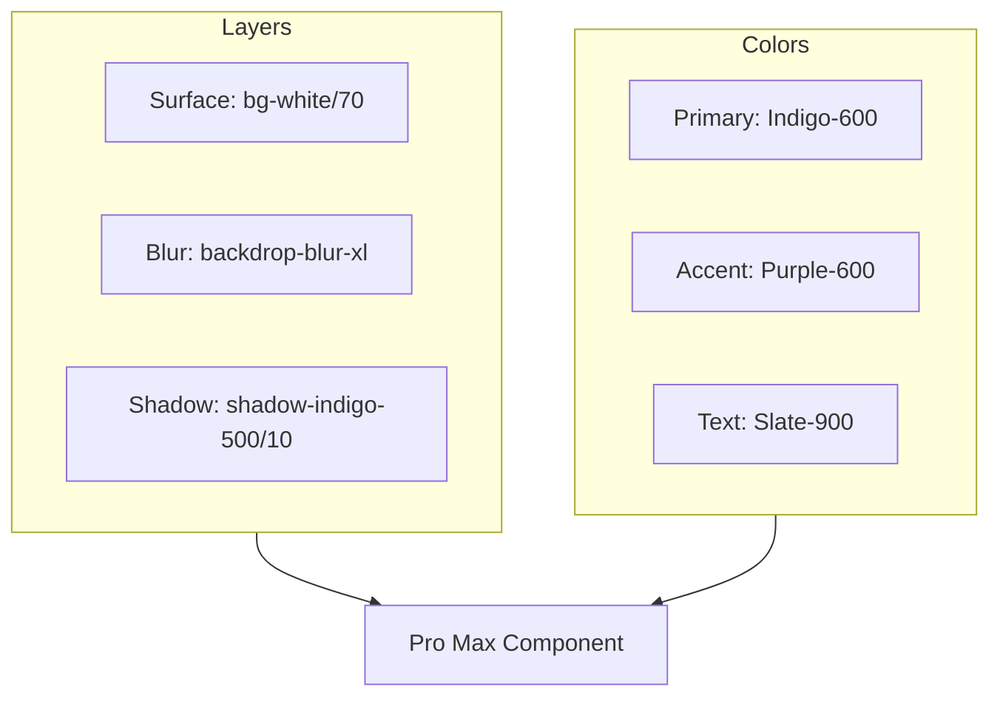
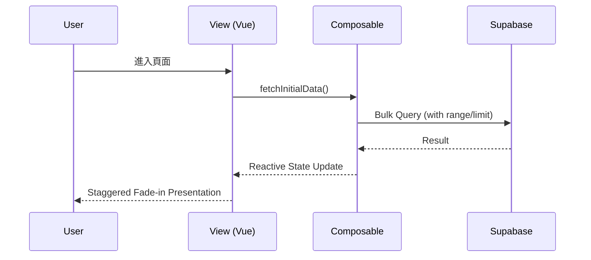

# 系統架構: 全局 UI/UX 與架構優化

## 1. 視覺語彙定義 (UI/UX Pro Max Standard)

為了確保全專案一致的高級感，我們定義以下視覺標準：

## 2. 全域組件優化策略

### 2.1 Navbar 結構優化
- **Before**: 固定的白色背景，傳統下拉選單。
- **After**: 
  - `sticky sticky-0` 搭配 `backdrop-blur`。
  - 滾動時自動調整透明度。
  - 使用者頭像與選單加入橫向滑入動畫。

### 2.2 資料載入與狀態管理 (System Design)
- **優化重點**: 減少重複渲染，統一使用 `LoadingSpinner` 組件。
- **資料流**:

## 3. 實作任務拆解 (SDD Phase 3 預覽)
1.  **Style Layer**: 更新全域 CSS 變數與玻璃擬態 Utility Classes。
2.  **Navbar**: 重新實作全域導覽列。
3.  **GiftCatalog**: 注入動畫與卡片陰影優化。
4.  **Admin Views**: 統一表格邊框、圓角與操作按鈕美學。
